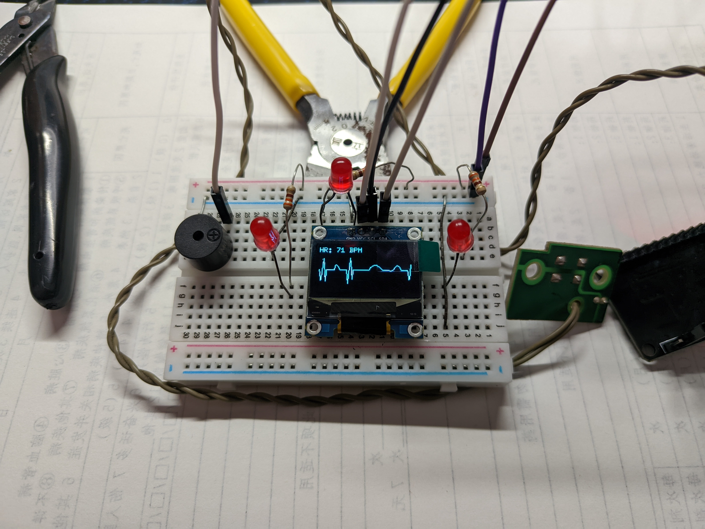

## ESP32 心率感应灯（任意心率广播穿戴设备 + OLED 心电图）

**作者 / Author：抖音 sxsxhh1 @没你好果汁吃  
哔哩哔哩 UID：510717943 @装作有网名丶**

**演示视频：**  
抖音：<https://v.douyin.com/Nna1Fs_QYVk/>  
B站：<https://b23.tv/7hVzfUw>



本项目使用 ESP32 通过 BLE 连接支持“心率广播”的穿戴设备（智能手环 / 手表等），读取实时心率数据，用 LED、蜂鸣器和 0.96 寸 OLED 显示心率数字和模拟心电图（ECG）波形。  
只要设备支持标准 **Heart Rate Service (0x180D)** 并开启心率广播，就可以使用本项目。

### 功能简介

- **BLE 连接穿戴设备**
  - 扫描附近 BLE 设备，按名称关键字或完整名称匹配目标设备
  - 使用标准 **心率服务 UUID：0x180D** 与 **心率特征 UUID：0x2A37** 进行订阅
  - 理论上兼容大多数支持 Heart Rate Service 的手环 / 手表（如华为、华米、小米等）

- **心率显示**
  - 数字模式：OLED 显示大号心率数字
  - 波形模式：OLED 显示滚动 ECG 心电图波形（包含早搏、心律不齐、心率过缓、房颤等随机事件模拟）
  - 无心率时：顶部显示 `HR: 0 BPM`，底部显示闪烁的 `!warning!` 提示

- **LED + 蜂鸣器反馈**
  - 未连接：板载 + 外接 LED 每 2 秒闪一次，蜂鸣器不响
  - 已连接且有有效心率：LED 和蜂鸣器按心跳频率闪烁 / “滴”
  - 已连接但无心率：LED 常亮，蜂鸣器持续报警

- **按键切换显示模式**
  - GPIO13 上拉输入，按钮另一端接 GND
  - 短按在 “数字模式 / 波形模式” 之间切换
  - 使用 `millis()` 实现消抖和单次触发（无阻塞）

### 硬件连接

- **开发板**：ESP32 DevKit V1

- **OLED 屏幕（SSD1306 128x64 I2C，0.96 寸）**
  - `VCC` / `VDD` → 3.3V
  - `GND` → GND
  - `SCL` / `SCK` → GPIO22 (`OLED_SCL`)
  - `SDA` → GPIO21 (`OLED_SDA`)

- **板载 LED**：GPIO2（`LED_PIN = 2`）

- **外接 LED**
  - 正极（长脚） → GPIO4 (`EXTERNAL_LED_PIN`)
  - 负极（短脚） → 电阻（330Ω ~ 1kΩ）→ GND

- **蜂鸣器（3V 有源蜂鸣器）**
  - `+` → GPIO15 (`BUZZER_PIN`)
  - `-` → GND

- **模式切换按钮**
  - 一端 → GPIO13 (`BUTTON_PIN`)
  - 一端 → GND（内部上拉）

### 软件依赖

- Arduino IDE + ESP32 开发板支持包
- 库：
  - ESP32 BLE（`BLEDevice.h` 等）
  - `U8g2`（OLED 显示）
  - `Wire`（I2C）

### 设备配置说明

在代码 `sxsxhh1.ino` 中可以配置你自己的穿戴设备名称 / MAC：

```cpp
#define TARGET_DEVICE_NAME "YourDeviceName"
#define TARGET_MAC_ADDRESS "xx:xx:xx:xx:xx:xx"
#define USE_MAC_MATCH true   // 若只按名称 / UUID 匹配，可改成 false
```

推荐步骤：
1. 先将 `USE_MAC_MATCH` 设为 `false`，只按名称 + 心率服务 UUID 匹配；
2. 确认能稳定连接后，在串口日志中记下真实 MAC，填入 `TARGET_MAC_ADDRESS`，再把 `USE_MAC_MATCH` 设为 `true` 提高精确度。

### 使用方法
1. 安装 ESP32 开发板支持和 U8g2 等库。
2. 打开 `sxsxhh1.ino`，根据你的设备名称 / MAC 适当修改配置宏。
3. 烧录到 ESP32。
4. 在你的手环 / 手表上开启心率广播 / 持续测量，并确保没有连接手机 App。
5. 上电 ESP32，串口监视器（115200）可看到扫描 / 连接 / 心率日志，OLED、LED、蜂鸣器按逻辑工作。

### 署名 / Attribution
- 抖音：**sxsxhh1 @没你好果汁吃**
- 哔哩哔哩：**UID 510717943 @装作有网名丶**

### 许可证 / License
本项目使用 **MIT License**，详见仓库中的 `LICENSE` 文件。
